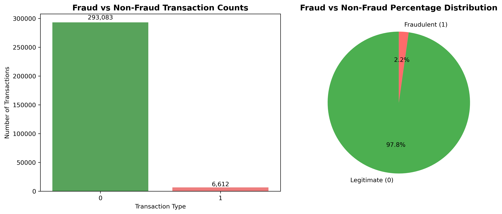
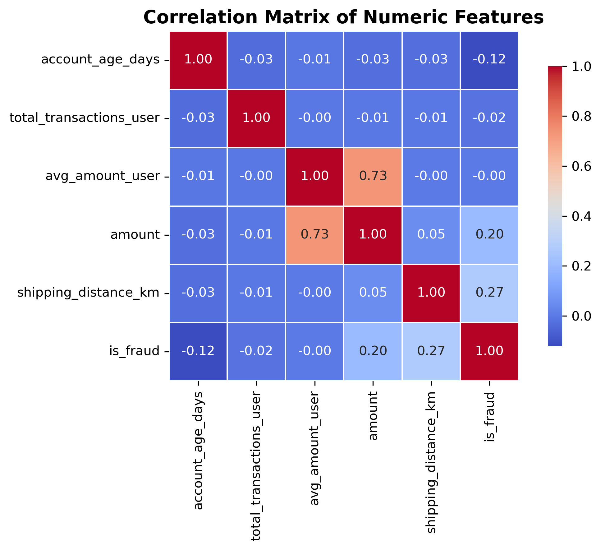

# E-Commerce Fraud Detection using Machine Learning  
### Predicting fraudulent transactions with XGBoost & FastAPI | Dockerized & Deployed on Render

## Problem Description

E-commerce platforms process millions of transactions every day. Even a small number of fraudulent transactions can lead to major financial losses, chargebacks, operational overhead, and customer dissatisfaction.

Fraud detection is a challenging problem due to:

- Highly imbalanced datasets (fraudulent cases are extremely rare)  
- Constantly evolving fraud patterns  
- The requirement for near real-time decision-making  
- The need to avoid false positives, which can negatively impact genuine users  

The objective of this project is to develop a machine learning–based fraud detection system that predicts whether a transaction is fraudulent using historical data and engineered features.

The project includes:

- Exploratory Data Analysis (EDA)  
- Feature engineering  
- Model training and comparison (Logistic Regression, Decision Tree, Random Forest, XGBoost)  
- Hyperparameter optimization and threshold tuning  

The final solution is built using the XGBoost model, optimized with a custom decision threshold of `0.80`, which balances fraud detection coverage and false positives.

The model is deployed as a REST API using FastAPI, containerized using Docker, and hosted on Render for real-time inference.

---

## How the Solution Is Used

### 1. Single Transaction Prediction 

When a transaction is processed, its details are sent to the `/predict` endpoint. The API responds with fraud probability and classification. 

```json
{
  "fraud_probability": 0.9875,
  "prediction": "Fraud"
}
```
Based on the model response:

| Prediction | Recommended Action                            |
|------------|-----------------------------------------------|
| Fraud      | Block transaction or send for manual review   |
| Legitimate | Approve transaction                           

### 2. Multiple Transactions (Batch Prediction)

The API also supports batch processing via the `/predict_batch endpoint`. This enables fraud detection for bulk transaction processing, which is particularly useful for nightly batch reviews or risk scoring at scale.

#### Example request:
```json
[
  {
    "transaction_id": 1,
    "user_id": 100,
    "account_age_days": 530,
    "total_transactions_user": 45,
    "avg_amount_user": 125.75,
    "amount": 180.50,
    "country": "US",
    "bin_country": "US",
    "channel": "web",
    "merchant_category": "electronics",
    "promo_used": 0,
    "avs_match": 1,
    "cvv_result": 1,
    "three_ds_flag": 1,
    "transaction_time": "2024-02-19T14:05:00Z",
    "shipping_distance_km": 350.2
  },
  {
    "transaction_id": 2,
    "user_id": 101,
    "account_age_days": 90,
    "total_transactions_user": 50,
    "avg_amount_user": 80.10,
    "amount": 950.00,
    "country": "FR",
    "bin_country": "RO",
    "channel": "app",
    "merchant_category": "gaming",
    "promo_used": 1,
    "avs_match": 0,
    "cvv_result": 0,
    "three_ds_flag": 0,
    "transaction_time": "2024-02-19T02:23:00Z",
    "shipping_distance_km": 2200.8
  }
]
```
#### Example Response
```json
[
  {
    "fraud_probability": 0.0383,
    "prediction": "Legitimate"
  },
  {
    "fraud_probability": 0.9342,
    "prediction": "Fraud"
  }
]
```

---

### Summary of integration

- Supports real-time single transaction scoring
- Enables batch fraud detection for multiple transactions
- Returns a probability score and final fraud prediction
- Suitable for integration into live payment systems or periodic transaction reviews
- Helps reduce financial losses while minimizing false positives

The system is suitable for real-world integration into transaction processing pipelines to minimize fraud risk and enhance payment security.

## Exploratory Data Analysis (EDA)

### 1. Dataset Overview

- **Total transactions:** `299,695`
- **Fraudulent transactions:** `6,612` (~2.2%)
- **Legitimate transactions:** `293,083` (~97.8%)
- **Unique users:** `6,000`
- **Missing values:** `None`

**Data source:** [E-Commerce Fraud Detection Dataset(Kaggle)]  
(https://www.kaggle.com/datasets/umuttuygurr/e-commerce-fraud-detection-dataset)

This synthetic but realistic dataset simulates e-commerce transactions across countries and platforms. It models patterns similar to actual financial fraud scenarios while preserving privacy.

---

### 2. Feature Overview

| Feature Type | Features |
|--------------|----------|
| **Identifier** | `transaction_id`, `user_id` |
| **Numerical** | `account_age_days`, `total_transactions_user`, `avg_amount_user`, `amount`, `shipping_distance_km` |
| **Categorical** | `country`, `bin_country`, `channel`, `merchant_category` |
| **Binary flags** | `promo_used`, `avs_match`, `cvv_result`, `three_ds_flag` |
| **Time-based** | `transaction_time` (later transformed) |
| **Target variable** | `is_fraud` (0 = legitimate, 1 = fraud) |

---

### 3. Fraud Distribution (Class Imbalance)

The target variable is heavily imbalanced:
- **Legitimate:** `293,083`
- **Fraud:** `6,612`

**Image in repository at:** `images/fraud_distribution.png`



**Key insight:**
- Fraudulent transactions represent only ~2.2% of the dataset
- Accuracy alone is misleading → we focused on **ROC-AUC, Precision, Recall, and F1-score**

---

### 4. Correlation of Numeric Features

**Image in repository:** `images/correlation_matrix.png`



**Important correlations with `is_fraud`:**
- `shipping_distance_km` → 0.27
- `amount` → 0.20
- `account_age_days` → -0.12

#### Interpretation:
* **Large shipping distances** → suspicious (possible cross-border fraud) 
* **Higher transaction amount** → higher fraud risk 
* **New accounts (low age)** → more likely involved in fraud

---

### 5. Mutual Information (Categorical/Binary Features)

| Feature | MI Score |
|---------|----------|
| `avs_match` | 0.0169 |
| `cvv_result` | 0.0149 |
| `three_ds_flag` | 0.0103 |
| `channel` | 0.0048 |
| `promo_used` | 0.0019 |
| `country` | 0.0002 |
| `bin_country` | 0.0001 |
| `merchant_category` | 0.0000 |

**Insight:**
- Security-related checks (`avs_match`, `cvv_result`, `three_ds_flag`) are strong indicators of fraud
- Country-based features have low standalone influence but improve performance when encoded effectively

---

### 6. Key Takeaways from EDA

1. **Severe class imbalance (~2.2% fraud)** → Metrics like accuracy are incorrect for model evaluation, use ROC-AUC, Precision, Recall, and F1-score.
2. **Transaction amount and shipping distance** are important fraud indicators.
3. **Newer accounts** (`low account_age_days`) are more likely to commit fraud.
4. **Security flag features** (`avs_match`, `cvv_result`, `three_ds_flag`) highly correlate with fraud.
5. **No missing data** → focus was on feature engineering rather than cleaning.

---

## Feature Engineering

To improve model performance and capture fraud-related behavioral patterns, a custom feature transformation pipeline was implemented using `FeatureEngineering` (located in **src/features.py**). This transformation is applied as the first step of the ML pipeline to ensure consistency during both training and inference.

### Key Transformations

| Feature | Description | Motivation |
|--------|-------------|------------|
| `amount_per_avg_ratio` | `amount / avg_amount_user` | Detect unusually high-value transactions specific to the user’s past behavior |
| `cross_country_flag` | 1 if `bin_country ≠ country`, else 0 | Flags transactions where the issuing card country differs from shipping country |
| `country_freq`, `bin_country_freq` | Frequency encoding of country columns | Capture population-based risk while handling cardinality |
| `hour`, `day_of_week` | Extracted from `transaction_time` | Fraud tends to follow unusual temporal patterns |
| `is_night` | 1 if time between 00:00–06:00 | Fraud typically increases during low monitoring hours |
| **Dropped:** `transaction_id`, `user_id` | Removed unique identifiers | Prevent data leakage and overfitting |
| **Dropped:** `country`, `bin_country`, `transaction_time` | Replaced by engineered temporal/geographic features | Avoid redundancy |

### Why This Matters

- Helps the model capture **behavioral anomalies** and **geographical inconsistencies**  
- Prevents **data leakage** by excluding unique identifiers  
- Temporal features (hour, day_of_week, is_night) helped improve detection of night-time fraud  
- The engineered features contributed to improved predictive performance, especially **precision and recall**

### Pipeline Integration

The transformer is used as part of the final ML pipeline:

```python
pipeline = Pipeline(
    steps=[
        ("featureengineering", FeatureEngineering()),
        ("vectorizer", DictVectorizer(sparse=False)),
        ("model", final_model),  # XGBClassifier
    ]
)
```

